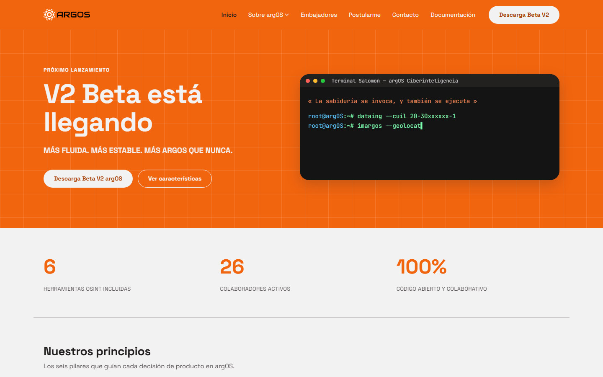
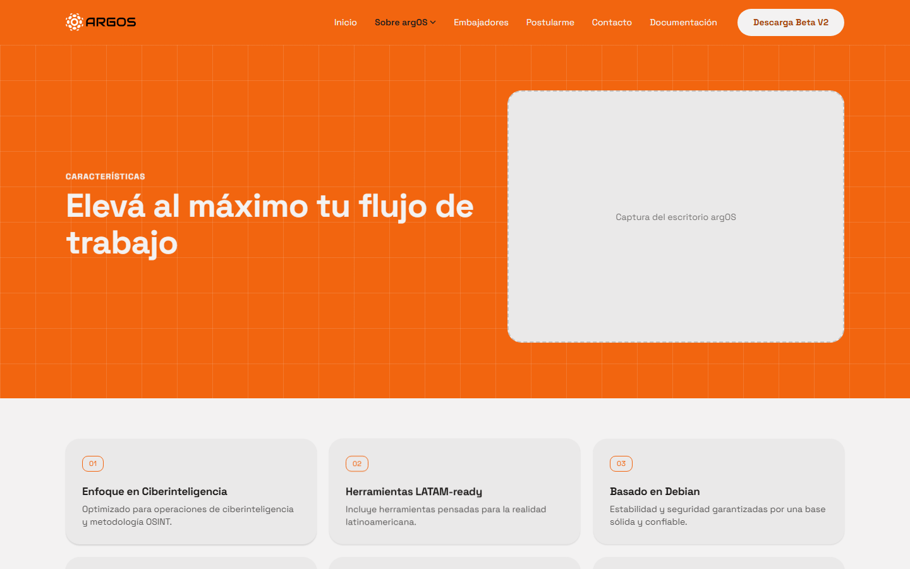
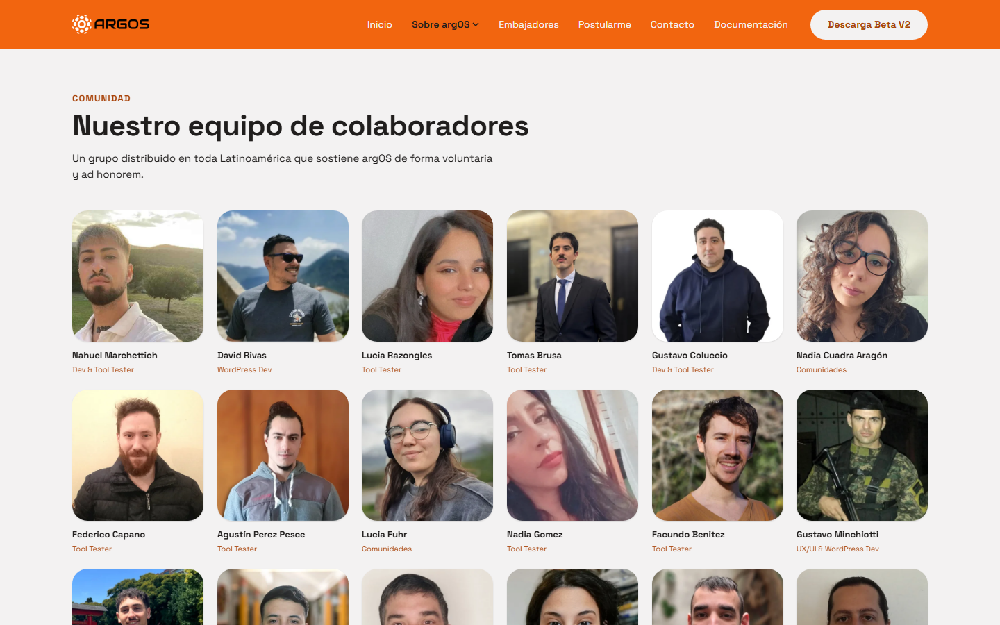
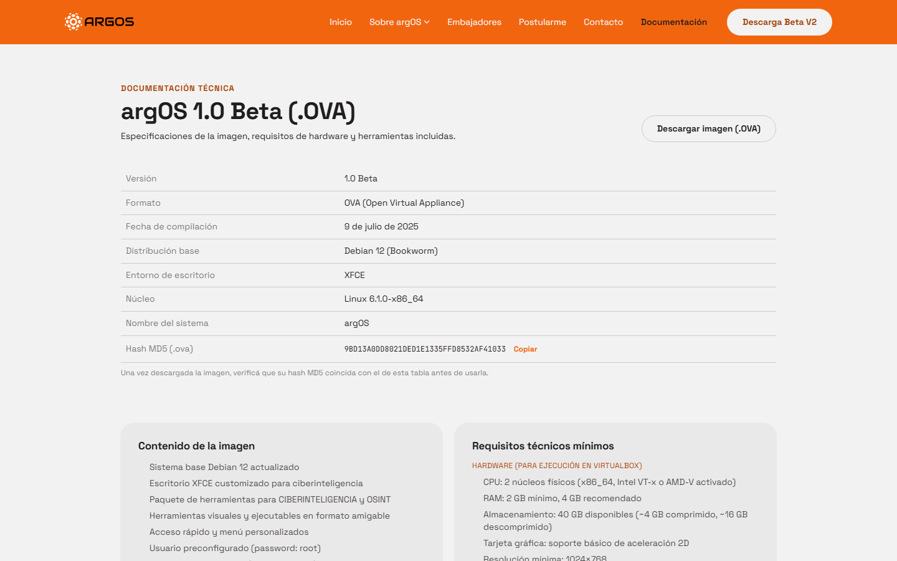

# argOS — Landing

Landing de modernización de **argOS**, sistema operativo Linux/Debian de
ciberinteligencia y OSINT hecho en Argentina — migrada del WordPress/PHP
original a **Astro + TypeScript + Tailwind CSS v4**.

**🔗 Sitio en vivo: [argos-landing-seven.vercel.app](https://argos-landing-seven.vercel.app)**

## Capturas

| Inicio | Características |
| --- | --- |
|  |  |

| Voluntarios | Documentación técnica |
| --- | --- |
|  |  |

## Qué tiene

- **7 páginas**: Inicio, Características, Voluntarios, Embajadores, Postularme, Contacto, Documentación técnica.
- **Terminal animado** en el hero (tipea comandos reales de las herramientas de argOS) y **contadores** que suben al cargar.
- **4 formularios** (beta signup, Embajadores, Postularme, Contacto) con verificación anti-spam (suma matemática, validada también en el servidor) y estados de carga/éxito.
- **Transiciones nativas de Astro** entre páginas (fade/slide), NavBar y Footer persistentes, y animaciones de scroll-reveal + entrada de hero con [anime.js](https://animejs.com/).
- **Cabeceras de seguridad reales**: CSP estricta (sin `unsafe-inline`, hashes por respuesta), HSTS, X-Frame-Options, Referrer-Policy, Permissions-Policy — ver `src/middleware.ts`.
- **23 fotos reales del equipo** en Voluntarios, logo real, tipografía Space Grotesk + JetBrains Mono.

## Stack

- **Astro** (`output: 'server'`, adapter `@astrojs/vercel`) — el sitio es ~95% contenido estático, pero se renderiza todo on-demand para que `src/middleware.ts` (cabeceras de seguridad) llegue a cada página, no solo a los endpoints `/api/*`.
- **Tailwind CSS v4** (`@theme` en `src/styles/global.css`) + tokens de diseño propios en `src/styles/tokens.css` (colores, tipografía, radios, sombras), todo dentro de `@layer base/components` — necesario en Tailwind v4 para que las utility classes puedan sobreescribir las clases custom.
- **anime.js v4** para scroll-reveal, entrada de hero y feedback de click — ver `src/scripts/animations.ts`.
- Sin framework de UI (React/Vue) — las islas usan `<script>` vanilla por componente, orquestadas desde `src/scripts/page-init.ts` en cada `astro:page-load`.

## Formularios → Supabase

Los 4 formularios postean a `src/pages/api/*.ts`, que delegan en `src/lib/submit.ts`.
Hoy esas funciones **validan y hacen `console.log`** — no hay proyecto Supabase
conectado todavía.

Para conectar Supabase cuando haya credenciales:
1. Aplicar `supabase/schema.sql` contra el proyecto (4 tablas: `beta_signups`,
   `ambassador_applications`, `volunteer_applications`, `contact_messages`, con RLS
   activado y sin policies públicas — los inserts van a ir server-side).
2. En cada función `insert*` de `src/lib/submit.ts`, reemplazar el `console.log` /
   comentario `TODO(supabase)` por `await supabase.from('<tabla>').insert(row)`.
3. Nada en las páginas ni en los endpoints de API necesita cambiar.

## Variables de entorno

Ver `.env.example`. Por ahora solo:

| Variable | Qué hace |
| --- | --- |
| `PUBLIC_OVA_DOWNLOAD_URL` | Link real de descarga de la imagen `.OVA` (página Documentación). Sin configurar, el botón queda en estado "pendiente" en vez de simular un link muerto. |

## Comandos

| Comando                 | Acción                                     |
| :----------------------- | :------------------------------------------ |
| `pnpm install`            | Instala dependencias                        |
| `pnpm dev`                | Servidor de desarrollo en `localhost:4321`  |
| `pnpm build`              | Build de producción a `./dist/`             |
| `pnpm exec astro check`  | Chequeo de tipos de archivos `.astro`       |

## Deploy

Proyecto en Vercel (`jmsd3v-projects/argos-landing`), conectado a este repo —
cada push a `main` dispara un deploy automático. Deploy manual puntual:

```bash
npx vercel deploy --prod
```

## Créditos

Fuente del diseño original (prototipos `.dc.html` + handoff): carpeta hermana
`Landing ArgOs/` en el mismo entorno de desarrollo (no versionada en este repo).
